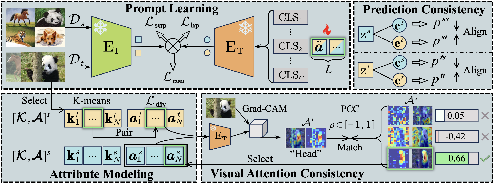

# VisTA: Cross-Domain Vision-Text Attribute Alignment [ACM MM 2025]

Official implementation of the paper "Cross-Domain Attribute Alignment with CLIP: A Rehearsal-Free Approach for Class-Incremental Unsupervised Domain Adaptation".

<div align="center">
  
</div>

## Installation 
Our code is implemented in Python (version $\geq$ 3.8) with PyTorch (version $\geq$ 1.11.0). Please follow below steps to configure dependencies:
```bash
# Install clip
git clone https://github.com/openai/CLIP.git
cd CLIP
pip install .

# Install dassl
git clone https://github.com/KaiyangZhou/Dassl.pytorch.git
cd Dassl.pytorch
pip install -r requirements.txt
pip install .

# Install other dependent package.
pip install -r requirements.txt
```

## Datasets
The datasets used for CI-UDA can be downloaded via the following links:

[Office-31](https://faculty.cc.gatech.edu/~judy/domainadapt/#datasets_code)

[Office-Home](https://drive.google.com/file/d/0B81rNlvomiwed0V1YUxQdC1uOTg/view?resourcekey=0-2SNWq0CDAuWOBRRBL7ZZsw)

[Mini-DomainNet](http://ai.bu.edu/DomainNet/)

## Training
For CI-UDA, we provide scripts to run experiments on Office-31, Office-Home and Mini-DomainNet, e.g., on Office-Home:

```bash
cd scripts
sh officehome.sh
```

## Citation
If you find the code useful in your research, please consider citing:

```bibtex
@inproceedings{VISTA,
author = {Mi, Kerun and Kang, Guoliang and Li, Guangyu and Zhao, Lin and Zhou, Tao and Gong, Chen},
title = {Cross-Domain Attribute Alignment with CLIP: A Rehearsal-Free Approach for Class-Incremental Unsupervised Domain Adaptation},
year = {2025},
booktitle = {Proceedings of the 33rd ACM International Conference on Multimedia},
pages = {},
numpages = {10},
series = {MM '25}
}
```

## Acknowledgments

Thanks sincerely for the following projects:

[CoOp](https://github.com/KaiyangZhou/CoOp)

[DAPrompt](https://github.com/LeapLabTHU/DAPrompt)

[AttriCLIP](https://github.com/vanity1129/AttriCLIP)